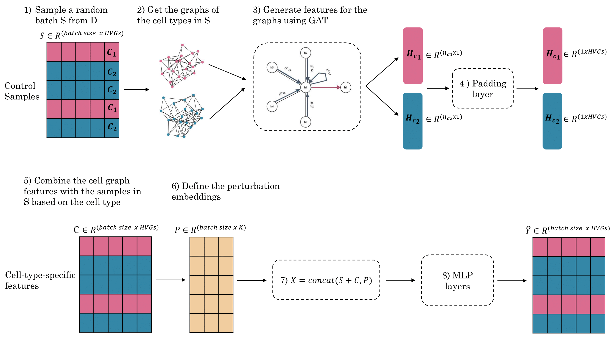

# Cell-Type-Specific-Graphs

**PrePR-CT** is a graph-based deep learning method designed to predict transcriptional responses to chemical perturbations in single-cell data. This method utilizes Graph Attention Network (GAT) layers to encode cell-type graphs from batches of training samples. These encoded graphs are then integrated with control gene expression data and predefined perturbation embeddings. The combined data is processed through Multi-Layer Perceptrons (MLPs) to accurately predict gene expression responses.

The preprint is available [here].

## Directories

### Data_Notebooks
This directory includes the pre-processing notebooks for each dataset, starting from the raw counts:
* [Kang dataset](https://www.ncbi.nlm.nih.gov/geo/query/acc.cgi?acc=GSE96583)
* [NeurIPS dataset](https://www.kaggle.com/competitions/open-problems-single-cell-perturbations)
* [McFarland and Chang datasets](http://projects.sanderlab.org/scperturb/datavzrd/scPerturb_vzrd_v1/dataset_info/index_1.html)
* [Nault dataset](https://github.com/BhattacharyaLab/scVIDR/tree/main)

### Training
This directory contains the training notebooks needed to reproduce the figures for each dataset. While results may slightly differ from the paper, they do not affect the overall conclusions.

