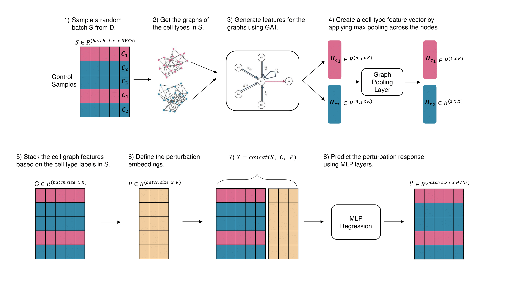

# Cell-Type-Specific-Graphs

**PrePR-CT** is a graph-based deep learning method designed to predict transcriptional responses to chemical perturbations in single-cell data. This method utilizes Graph Attention Network (GAT) layers to encode cell-type graphs from batches of training samples. These encoded graphs are then integrated with control gene expression data and predefined perturbation embeddings. The combined data is processed through Multi-Layer Perceptrons (MLPs) to accurately predict gene expression responses.

## Installation

Create a conda environment using the following packages:
<pre>
# Create a conda environment with Python 3.8.19
conda create -n preprct python=3.8.19

# Activate the environment
conda activate preprct

# Install dependencies
pip install -r requirements.txt

# Install PyTorch with CUDA 11.7 support
pip install torch==1.13.1+cu117 torchvision==0.14.1+cu117 torchaudio==0.13.1 \
  --extra-index-url https://download.pytorch.org/whl/cu117

# Additional dependencies
pip install jupyterlab
pip install torch_geometric==2.5.3
pip install ipywidgets --upgrade

# Create necessary directories
mkdir model_checkpoints
mkdir Data

</pre>

## Directories

### Data_Notebooks
This directory includes the pre-processing notebooks for each dataset, starting from the raw counts. The pre-processing steps are explained in the paper.
* [Kang dataset](https://www.ncbi.nlm.nih.gov/geo/query/acc.cgi?acc=GSE96583)
* [NeurIPS dataset](https://www.kaggle.com/competitions/open-problems-single-cell-perturbations)
* [McFarland and Chang datasets](http://projects.sanderlab.org/scperturb/datavzrd/scPerturb_vzrd_v1/dataset_info/index_1.html)
* [Nault dataset](https://github.com/BhattacharyaLab/scVIDR/tree/main)

### Training

This directory contains the training notebooks required to reproduce the figures for each dataset. While results may slightly differ from those reported in the paper, these variations do not affect the overall conclusions.

To reproduce the results for a specific dataset, download the corresponding `.h5ad` and `.pkl` files (named after the dataset) from the following links:

- https://figshare.com/s/7beaf41998af17bdbe33  
- https://figshare.com/s/b7f07ac5c522db3ba3af

The next step is to update the `config_train.yaml` file with the appropriate settings for the selected dataset, and then run the demo notebook to train and test the model.
